https://www.opengl.org/archives/resources/code/samples/glut_examples/progs.html[image:./images/opengl.jpg[./images/opengl,width=400,height=205]] +

https://www.opengl.org/archives/resources/code/samples/glut_examples/advanced.zip[]

== advanced.zip

image:./images/divider.gif[./images/divider,width=500,height=10]

[width="100%",cols="50%,~"]
|===
|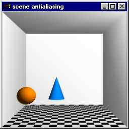 |
Using the accumulation buffers to anti-alias a scene.

Source code:
https://www.opengl.org/archives/resources/code/samples/glut_examples/advanced/accumaa.c[accumaa.c].

Snapshots: link:./images/accumaa.jpg[anti-aliased (shown)],
https://www.opengl.org/archives/resources/code/samples/glut_examples/advanced/accumaa1.jpg[aliased].
|===

[width="100%",cols="50%,~"]
|===
|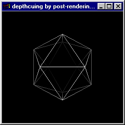
|
Adding depthcue (fog) in a second rendering pass.

Source code:
https://www.opengl.org/archives/resources/code/samples/glut_examples/advanced/af_depthcue.c[af++_++depthcue.c].

Snapshots: link:./images/af_depthcue.jpg[fog added by second pass
(shown)],
https://www.opengl.org/archives/resources/code/samples/glut_examples/advanced/af_depthcue1.jpg[fog
rendered normally].
|===

[width="100%",cols="50%,~"]
|===
|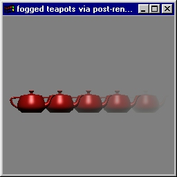
|
More detailed example of adding fog in a second rendering pass.

Source code:
https://www.opengl.org/archives/resources/code/samples/glut_examples/advanced/af_teapots.c[af++_++teapots.c].

Snapshots: link:./images/af_teapots.jpg[linear fog (shown)],
https://www.opengl.org/archives/resources/code/samples/glut_examples/advanced/af_teapots1.jpg[linear
fog added by second pass].
|===

[width="100%",cols="50%,~"]
|===
|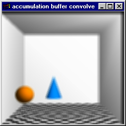 |
Using the accumulation buffer for fast convolutions.

Source code:
https://www.opengl.org/archives/resources/code/samples/glut_examples/advanced/convolve.c[convolve.c].

Snapshots: link:./images/convolve.jpg[5x5 blur (shown)],
https://www.opengl.org/archives/resources/code/samples/glut_examples/advanced/convolve1.jpg[laplace
transform].
|===

[width="100%",cols="50%,~"]
|===
|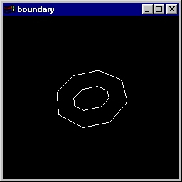 |
This example shows how to use the GLU polygon tessellator to determine
the 2D boundary of OpenGL rendered objects. The program uses OpenGL's
feedback mechanim to capture transformed polygons and then feeds them to
the GLU tesselator in GLU++_++TESS++_++WINDING++_++NONZERO and
GLU++_++TESS++_++BOUNDARY++_++ONLY mode.

Source code:
https://www.opengl.org/archives/resources/code/samples/glut_examples/advanced/boundary.c[boundary.c].

Snapshots: link:./images/boundary.jpg[torus (shown)].
|===

[width="100%",cols="50%,~"]
|===
|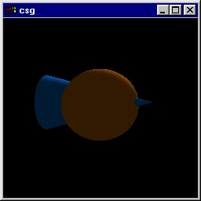 |
Composite solid geometry using the stencil buffer.

Source code:
https://www.opengl.org/archives/resources/code/samples/glut_examples/advanced/csg.c[csg.c].

Snapshots: link:./images/csg.jpg[A or B (shown)],
https://www.opengl.org/archives/resources/code/samples/glut_examples/advanced/csg1.jpg[A
sub B].
|===

[width="100%",cols="50%,~"]
|===
|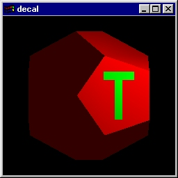 |
Decaling the letter "T" using the stencil buffer.

Source code:
https://www.opengl.org/archives/resources/code/samples/glut_examples/advanced/decal.c[decal.c].

Snapshots: link:./images/decal.jpg[T decal(shown)].
|===

[width="100%",cols="50%,~"]
|===
|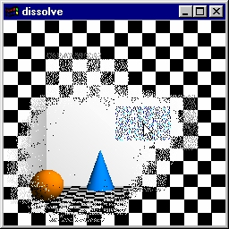 |
Dissolving using the stencil buffer.

Source code:
https://www.opengl.org/archives/resources/code/samples/glut_examples/advanced/dissolve.c[dissolve.c].

Snapshots: link:./images/dissolve.jpg[dissolved checkerboard (shown)].
|===

[width="100%",cols="50%,~"]
|===
|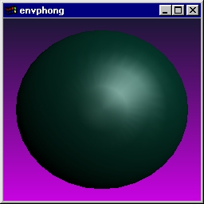 |
Demonstrates a use of environment texture mapping for improved highlight
shading.

Source code:
https://www.opengl.org/archives/resources/code/samples/glut_examples/advanced/envphong.c[envphong.c].

Snapshots: link:./images/envphong.jpg[sphere (shown)],
https://www.opengl.org/archives/resources/code/samples/glut_examples/advanced/envphong1.jpg[checkerboard
torus].
|===

[width="100%",cols="50%,~"]
|===
|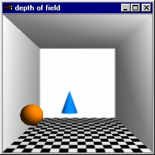 |
Using the accumulation buffer for depth of field (camera focus blur).

Source code:
https://www.opengl.org/archives/resources/code/samples/glut_examples/advanced/field.c[field.c].

Snapshots: link:./images/field.jpg[depth of field(shown)],
https://www.opengl.org/archives/resources/code/samples/glut_examples/advanced/field1.jpg[normal].
|===

[width="100%",cols="50%,~"]
|===
|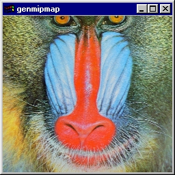
|
Example of how to generate texture mipmap levels with the accumulation
buffer.

Source code:
https://www.opengl.org/archives/resources/code/samples/glut_examples/advanced/genmipmap.c[genmipmap.c].

Snapshots: link:./images/genmipmap.jpg[mandrill mipmap (shown)].
|===

[width="100%",cols="50%,~"]
|===
|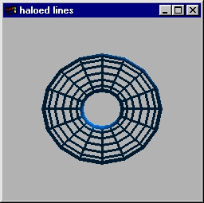 |
Draw haloed lines using the stencil buffer.

Source code:
https://www.opengl.org/archives/resources/code/samples/glut_examples/advanced/haloed.c[haloed.c].

Snapshots: link:./images/haloed.jpg[torus (shown)].
|===

[width="100%",cols="50%,~"]
|===
|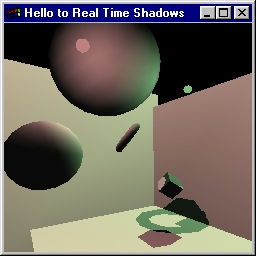
|
Demonstrates a method of generating real-time shadows.

Source code:
https://www.opengl.org/archives/resources/code/samples/glut_examples/advanced/hello2rts.c[hello2rts.c],
https://www.opengl.org/archives/resources/code/samples/glut_examples/advanced/rts.c[rts.c],
https://www.opengl.org/archives/resources/code/samples/glut_examples/advanced/rtshadow.h[rtshadow.h].

Snapshots: link:./images/hello2rts.jpg[scene (shown)].
|===

[width="100%",cols="50%,~"]
|===
|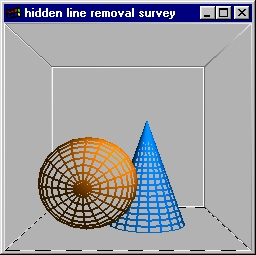
|
Line Rendering: Hidden line techniques.

Source code:
https://www.opengl.org/archives/resources/code/samples/glut_examples/advanced/hiddenline.c[hiddenline.c].

Snapshots: link:./images/hiddenline.jpg[fat lines (shown)].
|===

[width="100%",cols="50%,~"]
|===
|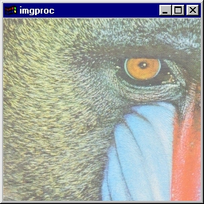 |
Examples of various image processing operations coded as OpenGL
accumulation buffer operations.

Source code:
https://www.opengl.org/archives/resources/code/samples/glut_examples/advanced/imgproc.c[imgproc.c].

Snapshots: link:./images/imgproc.jpg[saturated (shown)].
|===

[width="100%",cols="50%,~"]
|===
|image:./images/mipmap_lines.jpg[./images/mipmap++_++lines,width=256,height=256]
|
Survey of different mipmap filters.

Source code:
https://www.opengl.org/archives/resources/code/samples/glut_examples/advanced/mipmap_lines.c[mipmap++_++lines.c].

Snapshots: link:./images/mipmap_lines.jpg[GLU mipmaps on the left&#44;
MITCHELL mipmaps on the right (shown)].
|===

[width="100%",cols="50%,~"]
|===
|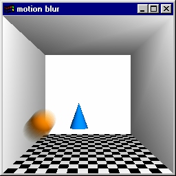
|
Using the accumulation buffer for motion blur.

Source code:
https://www.opengl.org/archives/resources/code/samples/glut_examples/advanced/motionblur.c[motionblur.c].

Snapshots: link:./images/motionblur.jpg[motion (shown)],
https://www.opengl.org/archives/resources/code/samples/glut_examples/advanced/motionblur1.jpg[normal].
|===

[width="100%",cols="50%,~"]
|===
|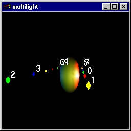
|
This program demonstrates virtualization of OpenGL's lights. The idea is
that if an object is lit by many lights, it is computationally more
efficient to calculate the approximate lighting contribution of the
various lights per-object and only enable the "brightest" lights while
rendering the object. This also lets you render scenes with more lights
than the OpenGL implementation light (usually 8). Two approaches are
used: The "distance-based" approach only enables the 8 closest lights
based purely on distance. The "Lambertian-based" approach accounts for
diffuse lighting contributions and approximates the diffuse
contribution.

Source code:
https://www.opengl.org/archives/resources/code/samples/glut_examples/advanced/multilight.c[multilight.c].

Snapshots: link:./images/multilight.jpg[scene (shown)].
|===

[width="100%",cols="50%,~"]
|===
|
|
Rendering shadows using projective transforms.

Source code:
https://www.opengl.org/archives/resources/code/samples/glut_examples/advanced/projshadow.c[projshadow.c].

Snapshots: link:./images/projshadow.jpg[shadows (shown)],
https://www.opengl.org/archives/resources/code/samples/glut_examples/advanced/projshadow1.jpg[no
shadows].
|===

[width="100%",cols="50%,~"]
|===
|image:./images/projtex.jpg[./images/projtex,width=256,height=256] |
Demonstrates simple projective texture mapping.

Source code:
https://www.opengl.org/archives/resources/code/samples/glut_examples/advanced/projtex.c[projtex.c].

Snapshots: link:./images/projtex.jpg[cube (shown)],
https://www.opengl.org/archives/resources/code/samples/glut_examples/advanced/projtex1.jpg[three
sides].
|===

[width="100%",cols="50%,~"]
|===
|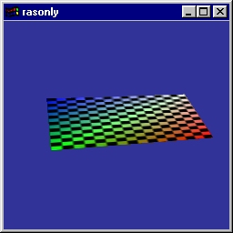 |
Demonstrates the use of OpenGL for rasterization-only, with
perspective-correct texture mapping.

Source code:
https://www.opengl.org/archives/resources/code/samples/glut_examples/advanced/rasonly.c[rasonly.c].

Snapshots: link:./images/rasonly.jpg[textured plane (shown)].
|===

[width="100%",cols="50%,~"]
|===
|image:./images/shadowfun.jpg[./images/shadowfun,width=256,height=256]
|
This program demonstrates a light source and object of arbitrary
geometry casing a shadow on arbitary geometry. The program uses OpenGL's
feedback, stencil, and boundary tessellation support.

Source code:
https://www.opengl.org/archives/resources/code/samples/glut_examples/advanced/shadowfun.c[shadowfun.c].

Snapshots: link:./images/shadowfun.jpg[shadows (shown)],
https://www.opengl.org/archives/resources/code/samples/glut_examples/advanced/shadowfun1.jpg[view
from light].
|===

[width="100%",cols="50%,~"]
|===
|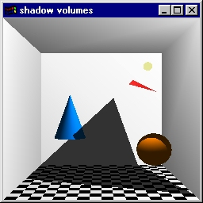
|
Demonstrate shadow volume techniques.

Source code:
https://www.opengl.org/archives/resources/code/samples/glut_examples/advanced/shadowvol.c[shadowvol.c].

Snapshots: link:./images/shadowvol.jpg[shadow (shown)],
https://www.opengl.org/archives/resources/code/samples/glut_examples/advanced/shadowvol1.jpg[volume].
|===

[width="100%",cols="50%,~"]
|===
|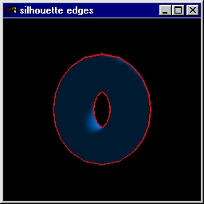
|
Generating silhouette edges with the stencil buffer.

Source code:
https://www.opengl.org/archives/resources/code/samples/glut_examples/advanced/silhouette.c[silhouette.c].

Snapshots: link:./images/silhouette.jpg[torus (shown)].
|===

[width="100%",cols="50%,~"]
|===
|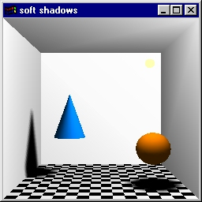
|
Demonstrate the use of accumulation buffer to create soft shadows.

Source code:
https://www.opengl.org/archives/resources/code/samples/glut_examples/advanced/softshadow.c[softshadow.c].

Snapshots: link:./images/softshadow.jpg[soft shadows (shown)],
https://www.opengl.org/archives/resources/code/samples/glut_examples/advanced/softshadow1.jpg[no
shadows].
|===

[width="100%",cols="50%,~"]
|===
|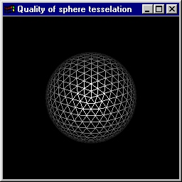 |
Different tesselations for a spherical shape.

Source code:
https://www.opengl.org/archives/resources/code/samples/glut_examples/advanced/tess.c[tess.c].

Snapshots: link:./images/tess.jpg[geodesic (shown)],
https://www.opengl.org/archives/resources/code/samples/glut_examples/advanced/tess1.jpg[longitude/lattitude].
|===

[width="100%",cols="50%,~"]
|===
|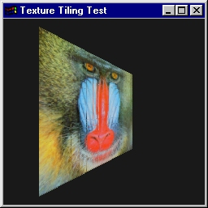 |
Demonstration of how to "tile" together small textures with a result
identical to if a much larger texture was drawn.

Source code:
https://www.opengl.org/archives/resources/code/samples/glut_examples/advanced/textile.c[textile.c].

Snapshots: link:./images/textile.jpg[tiled (w/o borders) (shown)].
|===

[width="100%",cols="50%,~"]
|===
|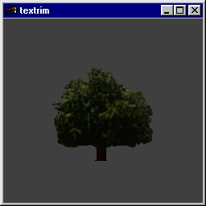 |
Trimming textures: demonstrates how alpha blending or alpha testing can
be used to "trim" the shape of textures to arbitrary shapes.

Source code:
https://www.opengl.org/archives/resources/code/samples/glut_examples/advanced/textrim.c[textrim.c].

Snapshots: link:./images/textrim.jpg[alpha tested (shown)],
https://www.opengl.org/archives/resources/code/samples/glut_examples/advanced/textrim1.jpg[no
alpha blending/testing].
|===

[width="100%",cols="50%,~"]
|===
|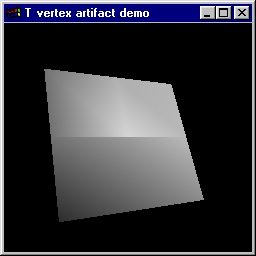 |
T-vertex artifacts example. The moral: Avoid vertex edge junctions that
make a T-shape.

Source code:
https://www.opengl.org/archives/resources/code/samples/glut_examples/advanced/tvertex.c[tvertex.c].

Snapshots: link:./images/tvertex.jpg[shaded T artifact (shown)],
https://www.opengl.org/archives/resources/code/samples/glut_examples/advanced/tvertex1.jpg[wireframe].
|===

[width="100%",cols="50%,~"]
|===
|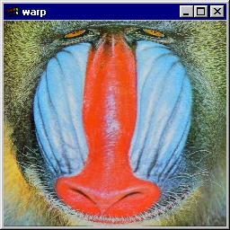 |
Image warping operations can be done via OpenGL texture mapping.

Source code:
https://www.opengl.org/archives/resources/code/samples/glut_examples/advanced/warp.c[warp.c].

Snapshots: link:./images/warp.jpg[warped mandrill (shown)].
|===

[width="100%",cols="50%,~"]
|===
|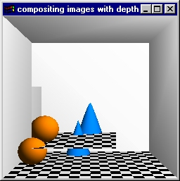
|
Compositing images that include depth information.

Source code:
https://www.opengl.org/archives/resources/code/samples/glut_examples/advanced/zcomposite.c[zcomposite.c].

Snapshots: link:./images/zcomposite.jpg[composited scene (shown)].
|===

image:./images/divider.gif[./images/divider,width=500,height=10]

====== Copyright © 1997 Silicon Graphics Incorporated.
