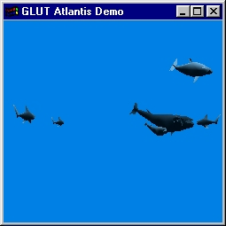
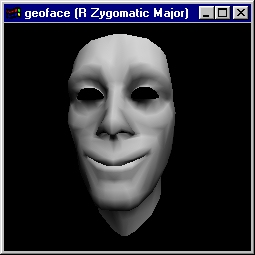
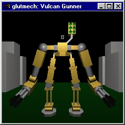
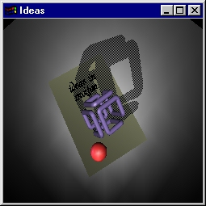
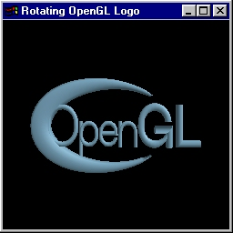
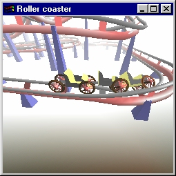
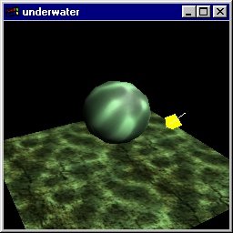
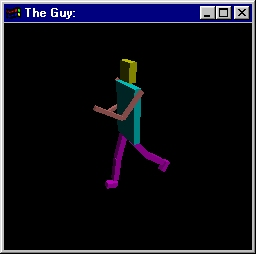
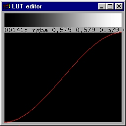

https://www.opengl.org/archives/resources/code/samples/glut_examples/progs.html[image:./images/opengl.jpg[./images/opengl,width=400,height=205]]

== https://www.opengl.org/archives/resources/code/samples/glut_examples/demos/[demos/]

image:./images/divider.gif[./images/divider,width=500,height=10]

[width="100%",cols="50%,50%",]
|===
| |
Swimming around with sharks, dolphins and whales.

Source code:
https://www.opengl.org/archives/resources/code/samples/glut_examples/demos/atlantis/[source
directory].

Zip file:
https://www.opengl.org/archives/resources/code/samples/glut_examples/demos/atlantis.zip[atlantis.zip].

Snapshots: link:./images/atlantis.jpg[fish (shown)].
|===

[width="100%",cols="50%,50%",]
|===
|image:./images/chess.jpg[./images/chess,width=256,height=256] |
Classical chess game with a crazy twist.

Source code:
https://www.opengl.org/archives/resources/code/samples/glut_examples/demos/chess/[source
directory].

Zip file:
https://www.opengl.org/archives/resources/code/samples/glut_examples/demos/chess.zip[chess.zip].

Snapshots: link:./images/chess.jpg[in game (shown)].
|===

[width="100%",cols="50%,50%",]
|===
| |
Contort this face as much as you want.

Source code:
https://www.opengl.org/archives/resources/code/samples/glut_examples/demos/geoface/[source
directory].

Zip file:
https://www.opengl.org/archives/resources/code/samples/glut_examples/demos/geoface.zip[geoface.zip].

Snapshots: link:./images/geoface.jpg[smile (shown)].
|===

[width="100%",cols="50%,50%",]
|===
| |
Walking (but not talking) vulcan gunner.

Source code:
https://www.opengl.org/archives/resources/code/samples/glut_examples/demos/glutmech/glutmech.c[glutmech.c].

Zip file:
https://www.opengl.org/archives/resources/code/samples/glut_examples/demos/glutmech.zip[glutmech.zip].

Snapshots: link:./images/glutmech.jpg[shaded (shown)],
https://www.opengl.org/archives/resources/code/samples/glut_examples/demos/glutmech1.jpg[walking].
|===

[width="100%",cols="50%,50%",]
|===
| |
The classic SGI demonstration program.

Source code:
https://www.opengl.org/archives/resources/code/samples/glut_examples/demos/ideas/[source
directory].

Zip file:
https://www.opengl.org/archives/resources/code/samples/glut_examples/demos/ideas.zip[ideas.zip].

Snapshots: link:./images/ideas.jpg[shadow (shown)].
|===

[width="100%",cols="50%,50%",]
|===
|
|
Cool OpenGL logo that spins into place.

Source code:
https://www.opengl.org/archives/resources/code/samples/glut_examples/demos/opengl_logo/[source
directory].

Zip file:
https://www.opengl.org/archives/resources/code/samples/glut_examples/demos/opengl_logo.zip[opengl++_++logo.zip].

Snapshots: link:./images/opengl_logo.jpg[final (shown)],
https://www.opengl.org/archives/resources/code/samples/glut_examples/demos/opengl_logo1.jpg[motion].
|===

[width="100%",cols="50%,50%",]
|===
|
|
Excellent rollercoaster simulation (you can really feel this one!).

Source code:
https://www.opengl.org/archives/resources/code/samples/glut_examples/demos/rollercoaster/[source
directory].

Zip file:
https://www.opengl.org/archives/resources/code/samples/glut_examples/demos/rollercoaster.zip[rollercoaster.zip].

Snapshots: link:./images/rollercoaster.jpg[cart (shown)],
https://www.opengl.org/archives/resources/code/samples/glut_examples/demos/rollercoaster1.jpg[rush].
|===

[width="100%",cols="50%,50%",]
|===
|
|
Caustic effects as viewed in underwater scenes.

Source code:
https://www.opengl.org/archives/resources/code/samples/glut_examples/demos/underwater/[source
directory].

Zip file:
https://www.opengl.org/archives/resources/code/samples/glut_examples/demos/underwater.zip[underwater.zip].

Snapshots: link:./images/underwater.jpg[greenish sea (shown)],
https://www.opengl.org/archives/resources/code/samples/glut_examples/demos/underwater1.jpg[cube
underwater].
|===

[width="100%",cols="50%,50%",]
|===
| |
Walking motion simulator (customizable).

Source code:
https://www.opengl.org/archives/resources/code/samples/glut_examples/demos/walker/[source
directory].

Zip file:
https://www.opengl.org/archives/resources/code/samples/glut_examples/demos/walker.zip[walker.zip].

Snapshots: link:./images/walker.jpg[walk (shown)].
|===

[width="100%",cols="50%,50%",]
|===
| |
Color editor with a very nice interface.

Source code:
https://www.opengl.org/archives/resources/code/samples/glut_examples/demos/yacme/[source
directory].

Zip file:
https://www.opengl.org/archives/resources/code/samples/glut_examples/demos/yacme.zip[yacme.zip].

Snapshots: link:./images/yacme.jpg[default (shown)].
|===

image:./images/divider.gif[./images/divider,width=500,height=10]

====== Copyright © 1997 Silicon Graphics Incorporated.
