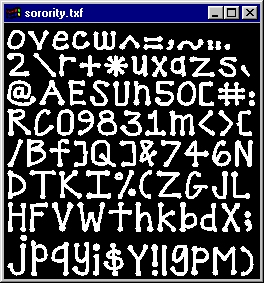
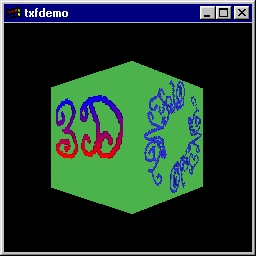

https://www.opengl.org/archives/resources/code/samples/glut_examples/progs.html[image:./images/opengl.jpg[./images/opengl,width=400,height=205]]
https://www.opengl.org/archives/resources/code/samples/glut_examples/texfont.zip[]

== texfont.zip

image:./images/divider.gif[./images/divider,width=500,height=10]

[width="100%",cols="50%,50%",]
|===
| |
A program to show the texture encoded within .txf files generated by
gentexfont.

Source code:
https://www.opengl.org/archives/resources/code/samples/glut_examples/texfont/showtxf.c[showtxf.c].

Executable:
https://www.opengl.org/archives/resources/code/samples/glut_examples/texfont/showtxf.bat[showtxf.bat].

Snapshots: link:./images/showtxf.jpg[sorority (shown)],
https://www.opengl.org/archives/resources/code/samples/glut_examples/texfont/showtxf1.jpg[haeberli].
|===

[width="100%",cols="50%,50%",]
|===
|
|
A program to show the texture encoded within .txf files generated by
gentexfont.

Source code:
https://www.opengl.org/archives/resources/code/samples/glut_examples/texfont/simpletxf.c[simpletxf.c].

Executable:
https://www.opengl.org/archives/resources/code/samples/glut_examples/texfont/simpletxf.bat[simpletxf.bat].

Snapshots: link:./images/simpletxf.jpg[scene (shown)].
|===

[width="100%",cols="50%,50%",]
|===
| |
A demonstration of texture mapped text using the TexFont API to put text
on a spinning cube, including text wrapped in a circle.

Source code:
https://www.opengl.org/archives/resources/code/samples/glut_examples/texfont/txfdemo.c[txfdemo.c].

Executable:
https://www.opengl.org/archives/resources/code/samples/glut_examples/texfont/txfdemo.bat[txfdemo.bat].

Snapshots: link:./images/txfdemo.jpg[OpenGL 3D (shown)],
https://www.opengl.org/archives/resources/code/samples/glut_examples/texfont/txfdemo1.jpg[3D
text].
|===

image:./images/divider.gif[./images/divider,width=500,height=10]

====== Copyright © 1997 Silicon Graphics Incorporated.
